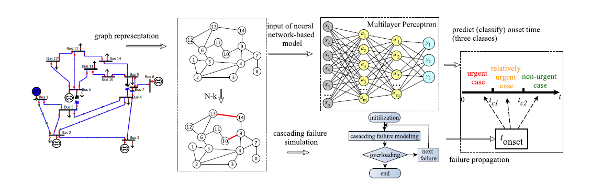

## Cascading Failure Learning

The relevant data and codes of our ISCAS2022 work "**Predicting Onset Time of Cascading Failure in Power Systems Using A Neural Network-based Classifier**".


## Requirements

- torch
- networkx
- numpy
- sklearn
- scipy # for loading matlab matrix


## Data description

In the **/data** folder, we provide the following samples for training or testing.

- Nm2: All samples (i.e., power parameter matrices and corresponding labels) on N-2 security criteria.
- Nm2_changed: 5000 samples generated from changing original state on N-2 security criteria.
- Nm3~Nm5: Corresponding samples generated on N-3/4/5/6 security criteria, 5000 samples for each subset.


## Code description

- main_mlp_topo.py: implements the mlp-based prediction task.
- utils.py: implements some basic functions such as data loading, label transform, etc.


## Run the demo

```
python main_mlp_topo.py
```